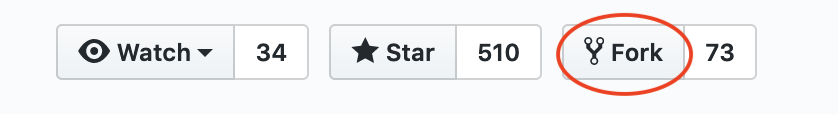

# Manage Consent Cookies as per IAB/GDPR Transparency and Consent Framework

# Usage Instructions for developers

### Getting Set Up

1. Fork this repository on GitHub as part of your project. You can fork by clicking on "Fork" on the top right corner:



2. Clone your forked repository (not our original one) to your hard drive with git clone `https://github.com/YOURUSERNAME/cookie-mgmnt.git` 
   
   The clone directory is: 
  `https://github.com/L3-iGrant/cookie-mgmnt.git`

3. `cd cookie-mgmnt/js`
	
	Use the `config.js` file to configure the Cookie consent banner of your choice. You are able to modify the text and headings etc using this config file. The table below summarises the variables used and its description.

	| Variable Name | Description |
	|---|----|
	| companyName | Name of the company/organization |
	| cookieBannerHeader | Header for the Cookie Banner |
	| cookieBannerDescription | Description text for the Cookie Banner |
	| cookieConsentSidebarMainText| Top description text for the Cookie manager sidebar |
	| cookieConsentSidebarSubTitle| Sub Heading for the Cookie manager sidebar|
	| cookieConsentSidebarSubDescription| Sub Heading Description for the Cookie manager sidebar|
	| privacyPolicy| Path to the privacy policy file eg.`privacy.html`|
	| cookiePolicy| Path to the cookie policy file eg.`cookiePolicy.html`|
	| numberOfPurposes| Number of purposes/cookie apps used|

	Below is the description on how to fill the details of Purposes/cookie apps which are used.

	| Purpose Variable| Description |
	|---|----|
	| name | Each app/purpose should have unique name to be identified |
	| cookietitle | Name of the purpose. This will be shown in the manager as purpose title|
	| description | Description about the purpose|
	| cookies | Mention which cookies are used for this purpose|
	| required | Value- `true` or `false` If true, user won't be able to disable the cookie of this purpose.|

### Calling the consent banners from your web files

1. Copy the head scripts from **cookie.html** to the pages where the Cookie Consent is required. You can ignore the first two scripts if already using jQuery and Bootstrap in you webpage.

**Head Scripts**
```html
   	
	<script src="https://ajax.googleapis.com/ajax/libs/jquery/3.3.1/jquery.min.js"></script>
	<link rel="stylesheet" href="https://maxcdn.bootstrapcdn.com/bootstrap/3.4.0/css/bootstrap.min.css">

	<script type="text/javascript" src="cookie-mgmnt/js/cookie_consent_headtags.js"></script>
	<script type="text/javascript" src="cookie-mgmnt/js/cookie_consent_body.js"></script>
	
```

## SetUp for non-gitHub users or non-developers
**Recommendations to Install or implement cookie consents using iGrant.io provided framework:**

1. Download the Cookie Consent directory files and put it the “Source/src” folder of your project where the index page resides. Make the folder name as "cookie-mgmnt".

2. Copy the head scripts from cookie.html to the pages where the Cookie Consent is required. You can ignore the first two scripts if already using jQuery and Bootstrap in you webpage.
```html
   	
	<script src="https://ajax.googleapis.com/ajax/libs/jquery/3.3.1/jquery.min.js"></script>
	<link rel="stylesheet" href="https://maxcdn.bootstrapcdn.com/bootstrap/3.4.0/css/bootstrap.min.css">
	
	<script type="text/javascript" src="cookie-mgmnt/js/cookie_consent_headtags.js"></script>
	<script type="text/javascript" src="cookie-mgmnt/js/cookie_consent_body.js"></script>
	
```

3. Use the config.js file to configure the Cookie consent banner and sidebar of your own choice.


