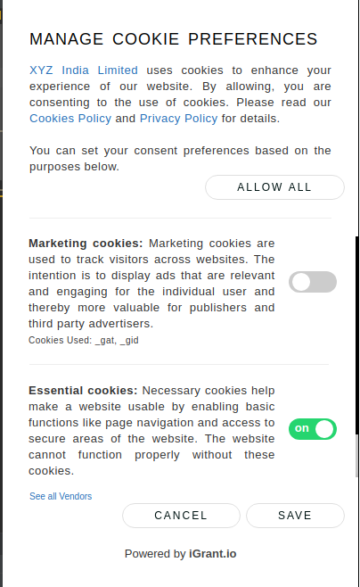

<h1 align="center">
    Cookie Consent Manager
</h1>

<p align="center">
    <a href="/../../commits/" title="Last Commit"></a>
    <a href="/../../issues" title="Open Issues"></a>
    <a href="./LICENSE" title="License"></a>
</p>

[](https://www.jsdelivr.com/package/gh/L3-iGrant/cookie-mgmnt)

<p align="center">
  <a href="#about">About</a> •
  <a href="#contributing">Contributing</a> •
  <a href="#licensing">Licensing</a>
</p>

## About

**Cookie Consent Manager** is a lightweight JavaScript plugin for alerting users about the use of cookies on your website.

It is designed to help you quickly comply with IAB/GDPR transparency and consent framework. We made it fast, free, and relatively painless.

We welcome community contributions and actively review pull requests.

## Screenshots




## Advantages

* **Free and Open Source**
* **Easy to use**
* **Flexible and customizable**: Manage consent for all possible types of
  third-party apps and easily customize the tool according to your needs.
* **Small footprint**

## Configuration

You define (and create) your own configuration as a JavaScript Object, containing as many properties as you deem necessary.

Below is an example,

```html
<link rel="stylesheet" href="https://cdn.jsdelivr.net/gh/L3-iGrant/cookie-mgmnt@2.0.2/dist/cookie-consent-ui.css" />
<script
    id="cookie-consent-ui"
    data-element-id="ccui"
    data-banner-title="YOUR DATA, YOUR CHOICE"
    data-banner-company-name="iGrant.io"
    data-banner-company-link="https://igrant.io"
    data-banner-cookie-policy-link="https://igrant.io/privacy.html"
    data-banner-privacy-policy-link="https://igrant.io/privacy.html#privacy"
    src="https://cdn.jsdelivr.net/gh/L3-iGrant/cookie-mgmnt@2.0.2/dist/cookie-consent-ui.js"
></script>
<script>
    window.CookieConsentUI([
    {
        consent: true,
        cookieCategory: "Essential Cookies",
        cookieCategoryDescription:
        "are necessary for this site to function properly, authenticating logins, for instance. You can only disable essential cookies via browser settings.",
        cookiesUsed: ["PrivacyPolicy"],
    },
    {
        consent: true,
        cookieCategory: "Analytical Cookies",
        cookieCategoryDescription:
        "provide information about how this site is being used so we can improve your experience. Data captured is aggregated and anonymized.",
        cookiesUsed: ["Analytics", "_ga", "_gid", "_gat"],
    },
    {
        consent: false,
        cookieCategory: "Advertising Cookies",
        cookieCategoryDescription:
        "are used for contextual ads from third parties.",
        cookiesUsed: ["AdSense"],
    },
    ]);
</script>
```

## Contributing

Feel free to improve the plugin and send us a pull request. If you found any problems, please create an Issue.

## Licensing
Copyright (c) 2023 LCubed AB (iGrant.io), Sweden

Licensed under the Apache License, Version 2.0 (the "License"); you may not use this file except in compliance with the License.

You may obtain a copy of the License at https://www.apache.org/licenses/LICENSE-2.0.

Unless required by applicable law or agreed to in writing, software distributed under the License is distributed on an "AS IS" BASIS, WITHOUT WARRANTIES OR CONDITIONS OF ANY KIND, either express or implied. See the LICENSE for the specific language governing permissions and limitations under the License.
