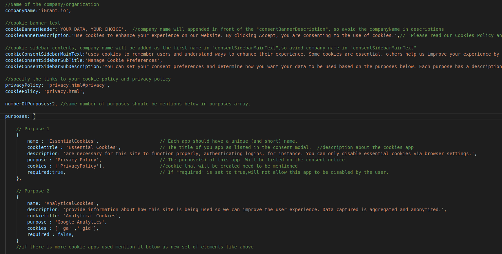

# Manage Consent Cookies as per IAB/GDPR Transparency and Consent Framework

# Usage

Download the whole CookieConsent directory and put it the src folder where the index page resides.

Use the config.js file to configure the Cookie consent banner of your choice.

All the text and headings can be made of your choice by mentioning it in config file.




| Variable Name | Description |
|---|----|
| companyName | Name of the company/organization |
| cookieBannerHeader | Header for the Cookie Banner |
| cookieBannerDescription | Description text for the Cookie Banner |
| cookieConsentSidebarMainText| Top description text for the Cookie manager sidebar |
| cookieConsentSidebarSubTitle| Sub Heading for the Cookie manager sidebar|
| cookieConsentSidebarSubDescription| Sub Heading Description for the Cookie manager sidebar|
| privacyPolicy| Path to the privacy policy file eg.`privacy.html`|
| cookiePolicy| Path to the cookie policy file eg.`cookiePolicy.html`|
| numberOfPurposes| Number of purposes/cookie apps used|

Here the description on how to fill the details of Purposes/cookie apps which are used.


| Purpose Variable| Description |
|---|----|
| name | Each app/purpose should have unique name to be identified |
| cookietitle | Name of the purpose. This will be shown in the manager as purpose title|
| description | Description about the purpose|
| Purpose | Decribes for what this purpose/app is used. Eg. `Google Analytics`|
| cookies | Mention which cookies are used for this purpose|
| required | Value- `true` or `false` If true, user won't be able to disable the cookie of this purpose.|


Copy the head scripts from **Cookies.html** to the pages where the Cookie Consent is required.

**Head Scripts**
```html
    <script type="text/javascript" src="cookieconsent/js/dynamic.js"></script>
    <script type="text/javascript" src="cookieconsent/js/config.js"></script>
    <script type="text/javascript" src="cookieconsent/js/cookie-manager.js"></script>
    <link rel="stylesheet" href="cookieconsent/css/cookieBanner.css">
    <link rel="stylesheet" type="text/css" href="cookieconsent/css/cookieSidebar.css" />
    <script src="cookieconsent/js/sidebar.js"></script>
    <script src="cookieconsent/js/sidebar-main.js"></script>
```
Put an **onload()** function to the body tag on every page.
```html
   <body onload="checkCookie()">
   ...
   </body>
```
Copy body part codes from **Cookie.html** to the pages where cookie Consent banner is required.

Place the copied code below the top navigation bar inside the body tag on your page. Place the code right below the **div** of
navigation buttons and inside the **nav** navigation tag.
```html
   <nav><!--Fixed top navigation bar-->
   <div><!-- Container begins --> 
   <div> <!-- Nav bar div -->
   ...
   </div> <!-- Nav bar div Ends -->
   <!--Begin cookie consent-->
      
      <!-- copy the code here -->
   
   <!--End cookie consent -->
   </div><!-- /.container ends here-->
   </nav><!--Top navigation ends here--><!-- /Fixed Top Navigation ends here-->
```


