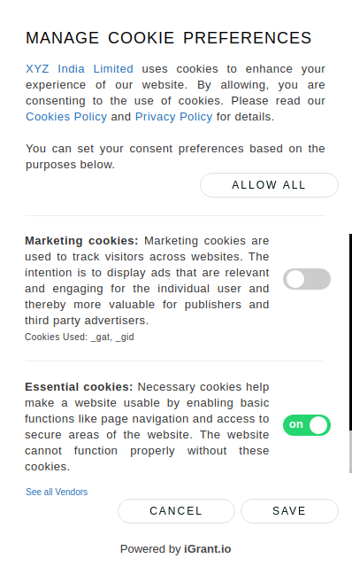

# Cookie Consent Manager

**Cookie Consent Manager** is a lightweight JavaScript plugin for alerting users about the use of cookies on your website.

It is designed to help you quickly comply with IAB/GDPR transparency and consent framework. We made it fast, free, and relatively painless.

We welcome community contributions and actively review pull requests.

## Screenshot




## Advantages

* **Free and Open Source**
* **Easy to use**
* **Flexible and customizable**: Manage consent for all possible types of
  third-party apps and easily customize the tool according to your needs.
* **Small footprint**

## Beginning your configuration

You define (and create) your own configuration as a JavaScript Object, containing as many properties as you deem necessary.

To get started, **apiKey** can be obtained from iGrant.io enterprise dashboard. If the cookie consent manager is configured as below, then the basic configuration and cookie purposes will be displayed as configured from iGrant.io enterprise dashboard. 

```html
<!-- Latest Version -->
<script src="https://cdn.jsdelivr.net/gh/L3-iGrant/cookie-mgmnt/build/cookieconsent.min.js" type="text/javascript"></script>
<script>
    var config = {
        "apiKey": "",
        "onConsent": function (cookieType) {},
        "onConsentRevoke": function (cookieType) {}
    };
    new CookieConsentManager(config);
</script>
```

If you don't have an API key, there is manual configuration mode where basic configuration and cookie purposes are passed through configuration object. Below is an example,

```html
<!-- Latest Version -->
<script src="https://cdn.jsdelivr.net/gh/L3-iGrant/cookie-mgmnt/build/cookieconsent.min.js" type="text/javascript"></script>
<script>
    var config = {
        "apiKey": "",
        "onConsent": function (cookieType) {},
        "onConsentRevoke": function (cookieType) {},
        "basic": {
            "BannerHeader": "YOUR DATA, YOUR CHOICE",
            "BannerDescription": "uses cookies to enhance your experience of our website. By clicking Allow, you are consenting to the use of cookies.",
            "SidebarMainText": "uses cookies to enhance your experience of our website. By allowing, you are consenting to the use of cookies.",
            "SidebarSubtitle": "Manage Cookie Preferences",
            "SidebarSubDescription": "You can set your consent preferences based on the purposes below.",
            "CookiePolicyURL": "privacy.html",
            "CompanyPolicyURL": "",
            "CompanyName": "XYZ India Limited"
        },
        "cookiePurposes": [
            {
                "Title": "Google Adsense",
                "CookieTypeName": "Marketing cookies",
                "Description": "For displaying advertisment using Google Adsense to gain revenue",
                "BrowserCookies": [
                    "_gat",
                    "_gid"
                ],
                "IsRequired": false
            },
            {
                "Title": "Stripe",
                "CookieTypeName": "Essential cookies",
                "Description": "For integrating stripe payment gateway",
                "BrowserCookies": [
                    "__stripe_mid"
                ],
                "IsRequired": true
            }
        ]
    };
    new CookieConsentManager(config);
</script>
```

## Contributing

Feel free to improve the plugin and send us a pull request. 